# BoxZero - a fully-boxed V0/T0/X0 mod

Simplify, strengthen, and seal your [Voron Zero](https://github.com/VoronDesign/Voron-0) or V0-derived printer ([Tri-Zero](https://github.com/zruncho3d/tri-zero), [Double Dragon](https://github.com/zruncho3d/double-dragon)) by ditching the tophat and moving to a full-box frame.

Mod an existing printer or build a BoxZero from scratch, keeping the 200mm extrusions of a stock V0 frame kit.

Pairs exquisitely with [Tri-Zero](https://github.com/zruncho3d/tri-zero) (a triple-belted Z mod) and [ZeroPanels](https://github.com/zruncho3d/ZeroPanels) (clip-in, clip-out enclosure panels), both shown below.

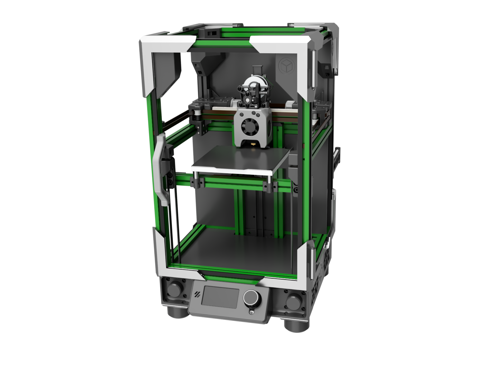

|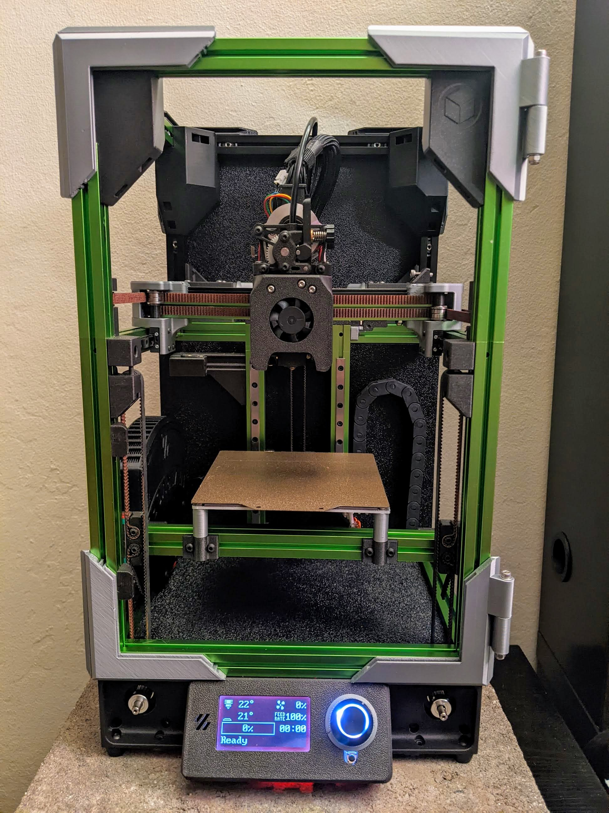 | 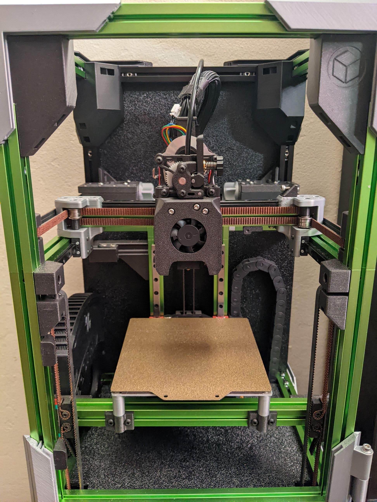 | 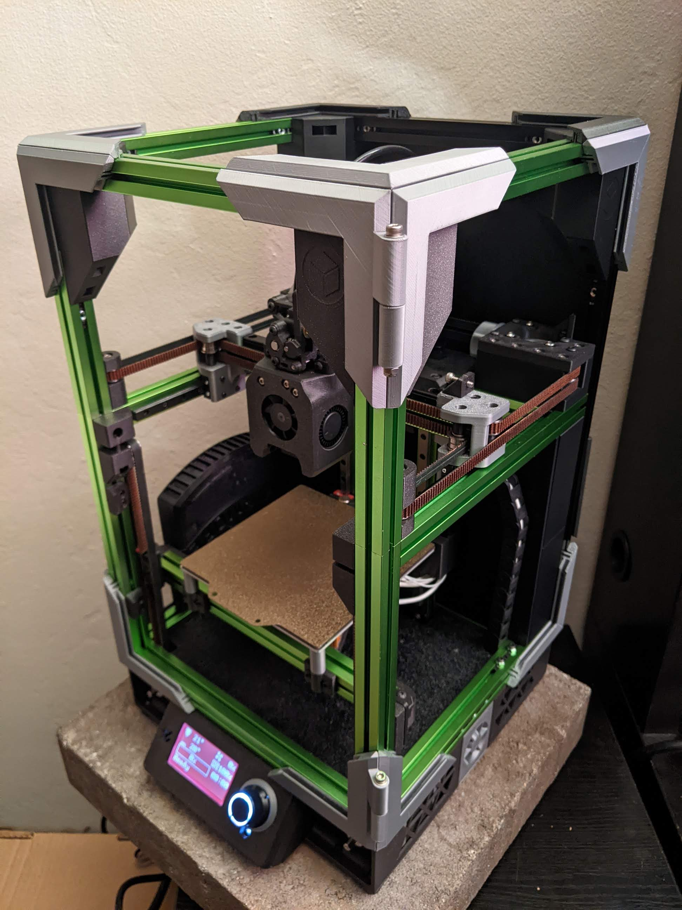 |
| - | - | - |

| 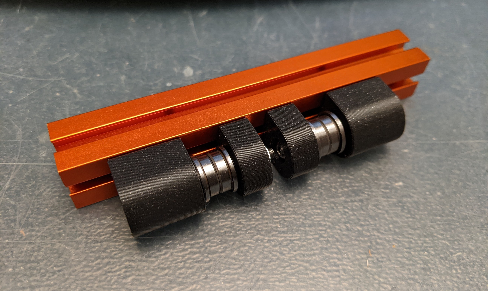 | 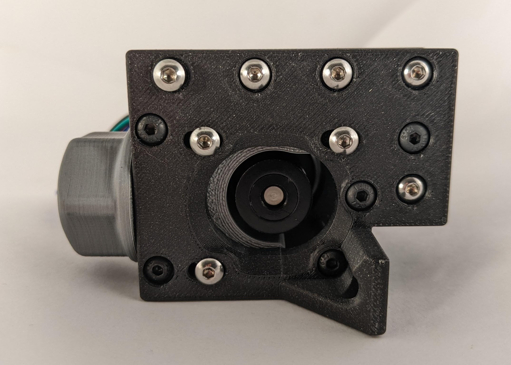 | 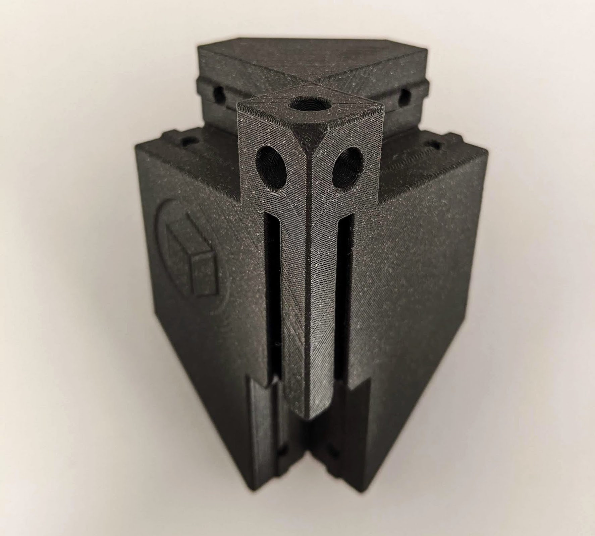 |
| - | - | - |

Join us on the `#doomy-worx` channel on the [DoomCube Discord](https://discord.gg/doomcube) - to ask questions, or share your experiences with this mod!

### Updates

#### 2022-04-XX First Release!

Hello World, BoxZero.

See how it compares, visually:

| BoxZero +TriZero +ZeroPanels +MiniAS +12864 | BoxZero +ZeroPanels | Voron Zero with Tophat (stock V0.1) |
| - | - | - |
| 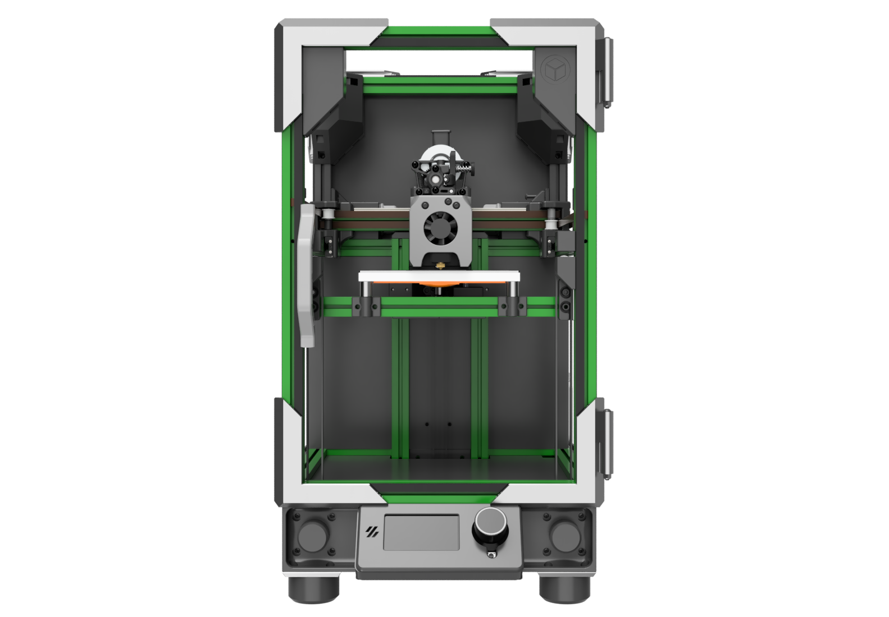  | 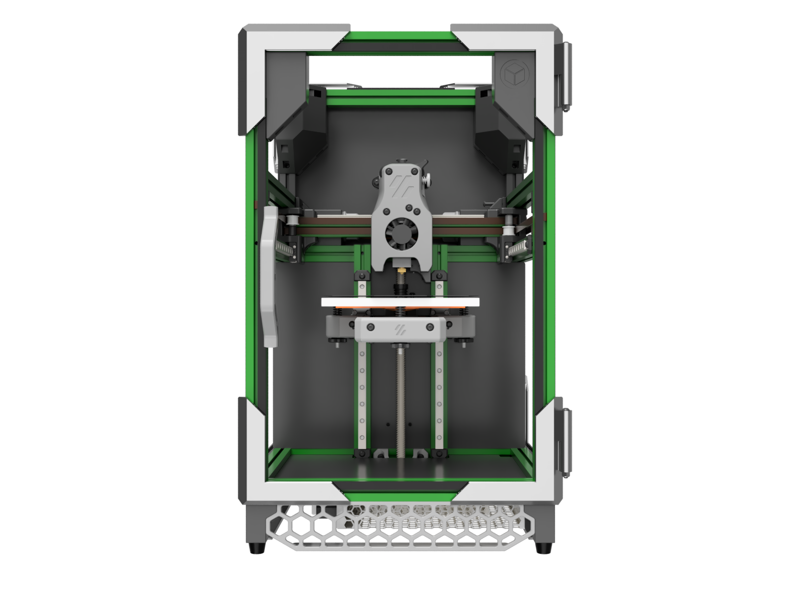 | 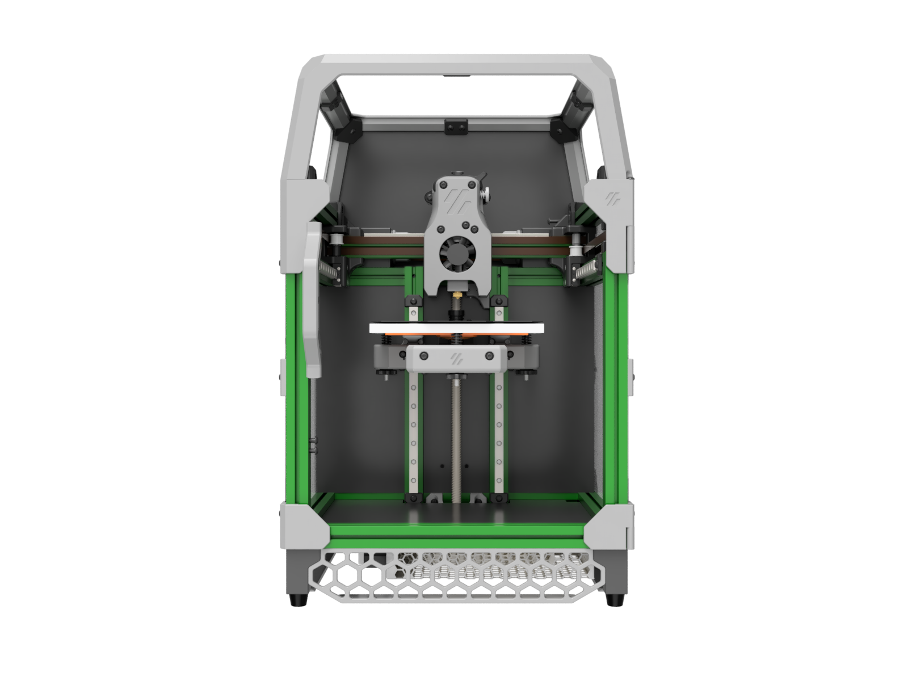
|   | 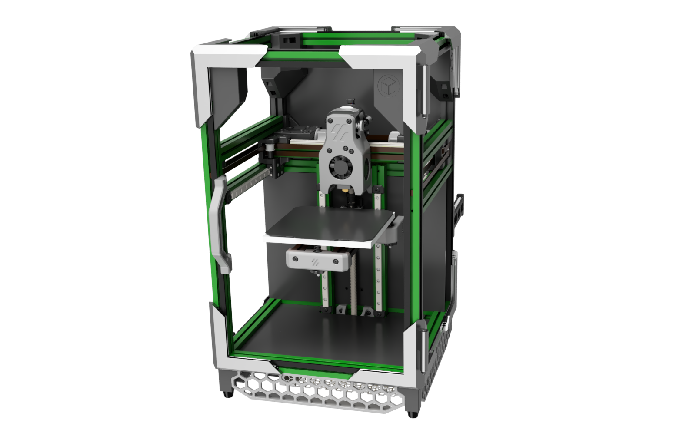 | 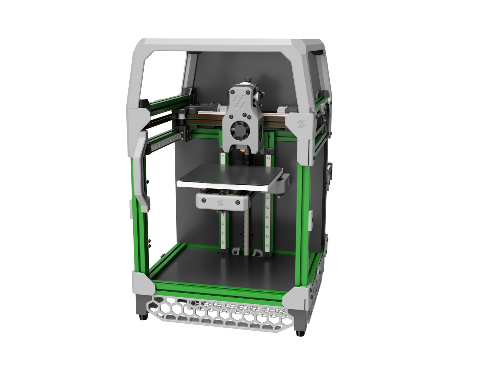

## Why this mod?

The V0 tophat serves its function: to cover the top umbilical and enclose the printer.

But ask a bunch of V0 owners... and let's just say, few will express their undying love for the tophat.  Actual unsolicited quotes heard in just the last week:
>  "Yeah, the tophat is kind of the bane of my V0 experience"

> "Can you tell I really dislike the tophat? They started bugging me less after I added a hinged riser that is a solid square. It does not match well enough so it looks bad that way but the stiffness and hinges are what the original should have had."

The V0 tophat creates real quality-of-life issues in practice:
* It's a notoriously challenging print that requires the entire bed of a Voron Zero and good bed adhesion and leveling.
* The small trapezoidal panels are harder to source than rectangular parts.
* The design adds many small parts to print and many heatsets to add.
* To clear the umbilical with some toolhead mods (e.g. [Mini-AfterSherpa](https://github.com/KurioHonoo/Mini-AfterSherpa)), a tophat extension is needed, ideally a [hinged one](https://github.com/zruncho3d/VoronUsers/tree/hinged_tophat/printer_mods/zruncho/Hinged_Tophat_Riser).  But those "censor the view" and require even more parts to print and source.
* It doesn't scale easily.  You can add extensions ([X0 example](https://github.com/zruncho3d/double-dragon/blob/main/STLs/Optional/Tophat_Middle_Spacer_x2.stl)), but you really want to increase the beam thickness too, and not need extensions to fit a V0 plate.
* You can't mount stuff to it easily, at least compared to extrusions (like lights or a camera).

## How does it work?

This mod ditches the tophat by moving to a fully-boxed frame, then updates each part affected by the change to fit in the remaining space.

### Frame and Corners

You will need additional extrusions to box the frame and make a "fixed tophat".  Don't worry though, you can easily add a hinged top panel. Here is the extra extrusion content, visualized:

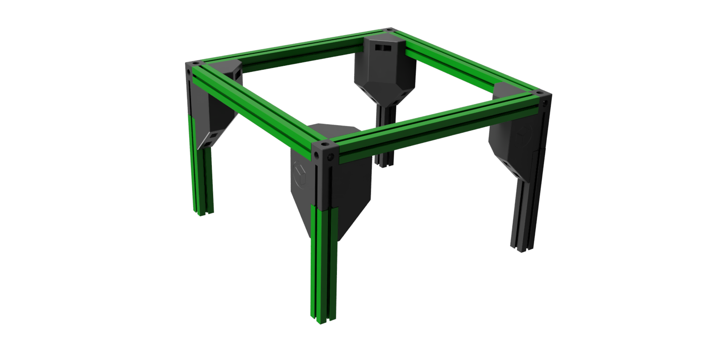

You can keep your colored extrusions from a V0 frame kit by joining 100mm ones from the bed with 200mm ones in the front.

Or, you can use same-day-shipping, off-the-shelf 1515 300mm-long extrusions and add the blind joint holes yourself.  This repo includes a printed extrusion wrench for joining extrusions with marraing the surface, along with printer corners to add enough vertical clearance to clear the umbilical.

But these are optional.  You can use a full-blind-joints frame with taller extrusions (350mm or taller).  You can further strengthen the corners with smaller corner stiffeners too, which are recommended for larger sizes that V0-stock.

| Large Corner (adds 50mm height) | Small Corner Stiffener |
| - | - |
|  | 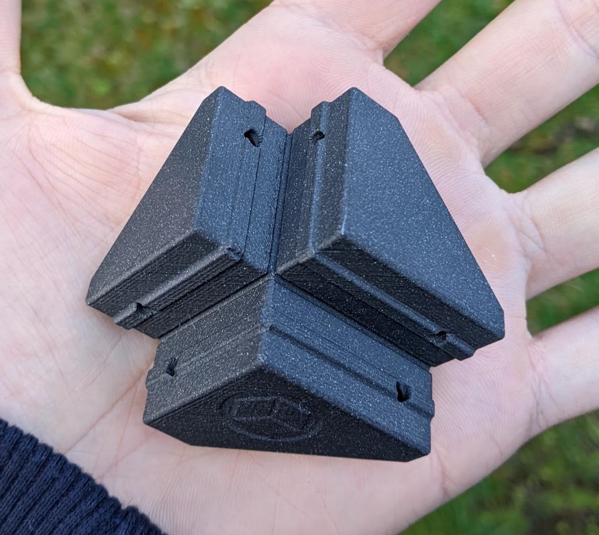 |

The V0 side and bed extrusions get lifted, then other extrusions take their place.  There are a few options:

* **Option A: Replace all verticals with 300s**.  Move 2 of the existing 200s to the top.
* **Option B: Replace the rear 2 verticals with 300s**.  Move 2 of the existing 200s to the top, then add 100mm extrusions to replace the ones for the bed and colorize the front.  
  * If you have a Kirigami bed or T0 mod, the 100s will be easily available.  
  * You'll still need an additional 200mm extrusion.
  * Add 100mm to the verticals.
  * Conjoin the extrusions with set screws an add 2 200mm extrusions to span the gaps.
* **Option C Mix of 100 and 200mm-length extrusions**.  Effectively, add a fixed tophat.
* **Option D: Go full-height with cut-to-size extrusions**.  Then use the smaller stiffeners, vs the full-size extrensions.

It all depends on what's easiest to source and what you think looks best.  It's all good.

### AB Blocks and Front Idlers

The packaging of the V0 is super-tight, so the challenge with a full box is to fit the belt path around the motors.  The key insight was to add an extra set of F623 bearings to redirect the belts around the rear frame, away from the rear corners.  At the front, this mod uses slightly modified [Double Dragon](https://github.com/zruncho3d/double-dragon) front Y idlers for the main belts.

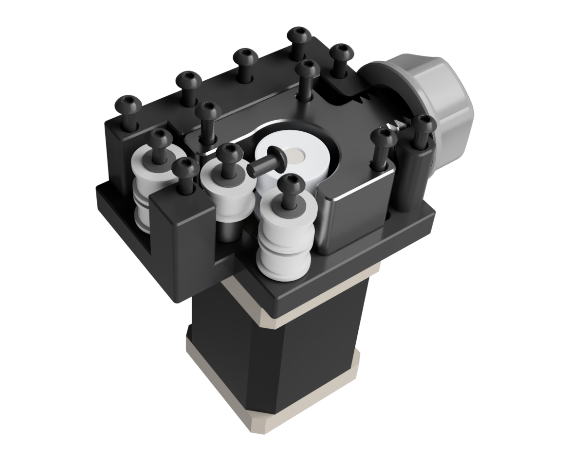

| 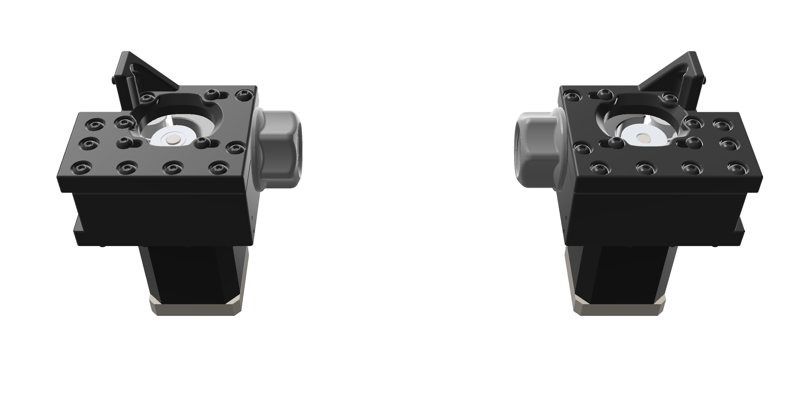 | 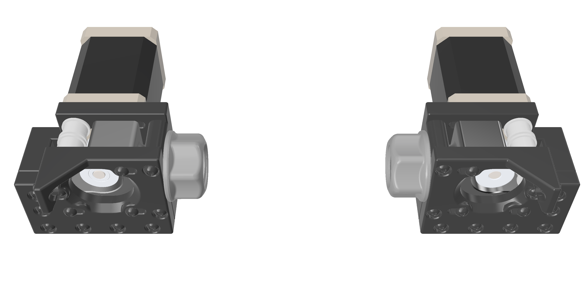 |
| - | - |

The belt is either redirected around the added idler, or passes to the main pulley and back around.  This early sketch gives a sense of how it works:

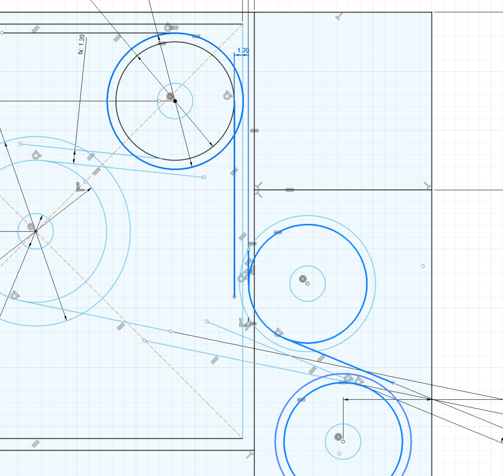

### Enclosure

You can use the default V0 enclosure parts, or much better, can move to [ZeroPanels](https://github.com/zruncho3d/ZeroPanels), which clip in without screws, nuts, magnets, or tape. They're perfect for this application.

[Tecnologic's full boxed-frame enclosure](https://github.com/Tecnologic/ZeroPanels/tree/main/Mods/tecnologic/FlyingZero300), based on the original ZeroPanels, works perfectly here and even includes high-strength, 270-degree hinges.  What's not to love?  You can put the hinges on top too... BAM, and you have a fully accessible toolhead, without even needing 5 seconds to clip out a panel.

| Main Corners | Hinge Corners |
| - | - |
| 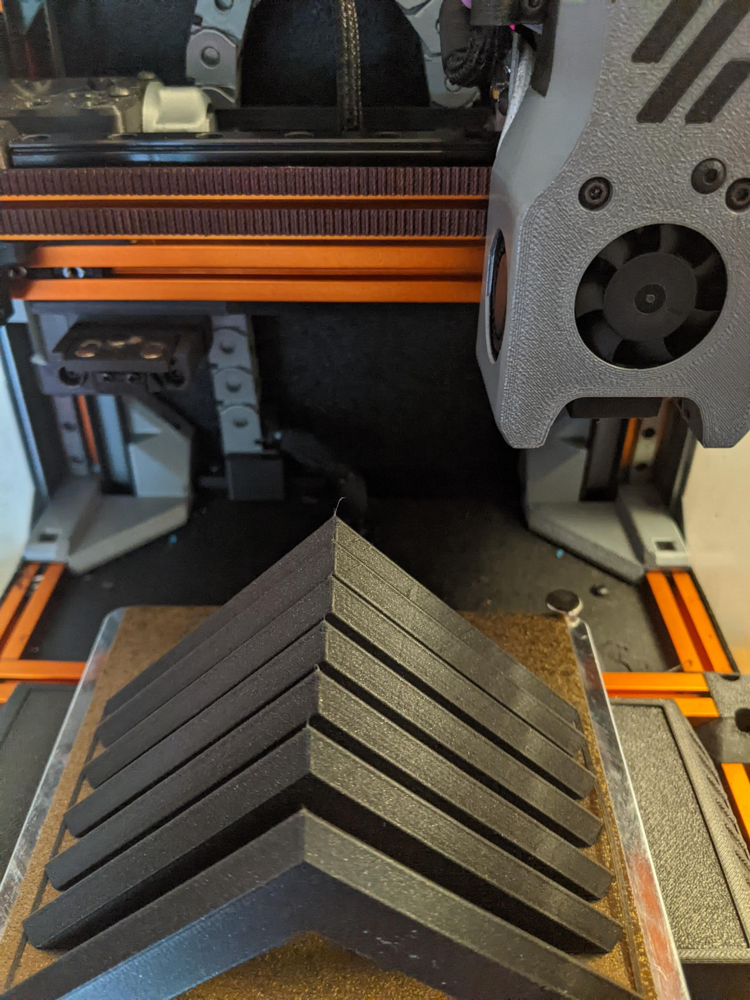 | 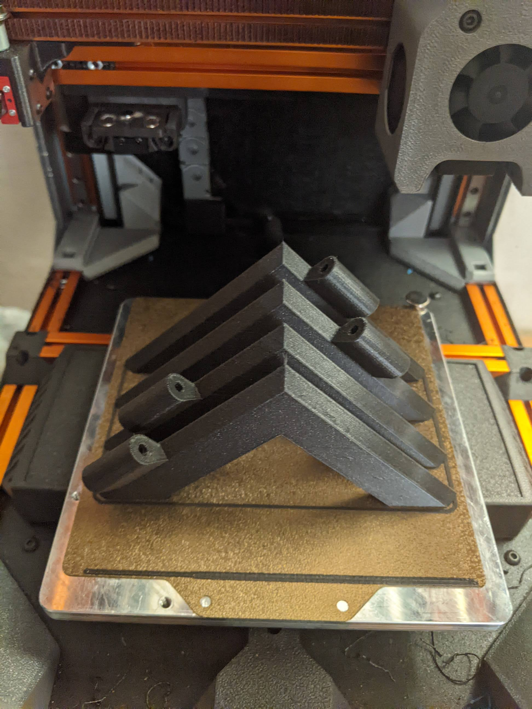 |

See a video of [ZeroPanels clipping in and out, and then in and out again](https://www.youtube.com/watch?v=L3nBHkO4VzE).

### Other changes

Actually, that's it.  The belt path is shorter, so you can reuse and then trim your existing belts.  The midplate and baseplate are retained.

### BOM

These are just the parts beyond those needed for a stock V0.

| Category | Part | Qty | Notes | Link |
| - | - | - | - | - |
| Fasteners | M3x6 BHCS | N | For corners |
| Fasteners | M3 BHCS Various | N | For AB drives, frames, idlers, etc. |
| Fasteners | 12mm set screw | 1 per join | Optional for extrusion joins; can get from screw |
| Extrusions | 300mm 1515 | 4 | Option A for extrusions | [MBXL 300mm at Amazon](https://www.amazon.com/MakerBeam-XL-Anodized-300x15x15mm-Pieces/dp/B06XJ5G5QY) |
| Extrusions | 300mm 1515 | 2 | Option B for extrusions | [MBXL 300mm at Amazon](https://www.amazon.com/MakerBeam-XL-Anodized-300x15x15mm-Pieces/dp/B06XJ5G5QY) |
| Extrusions | 200mm 1515 | 1 | Option B for extrusions | [MBXL 200mm at Amazon](https://www.amazon.com/dp/B06XHQH9WH) |
| Extrusions | 100mm 1515 | 4 | Option C for extrusions | [MBXL 100mm at Amazon](https://www.amazon.com/gp/product/B06XJ4T6TW/ref=ppx_yo_dt_b_search_asin_title?ie=UTF8&psc=1) |
| Extrusions | 200mm 1515 | 4 | Option C for extrusions | [MBXL 200mm at Amazon](https://www.amazon.com/dp/B06XHQH9WH) |
| Extrusions | 350mm 1515 | 4 | Option D for extrusions | Misumi |
| Bearings | F623 flanged bearing | 8 | For AB blocks
| Panels | 212x332x3mm panel | 3x | Side and front panels, clear acrylic
| Panels | 212x212x3mm panel | 1x | Top panel, clear acrylic

### What do you mean by Alpha Release?

The parts actually work, and have been tested in a working printer.  But sizes and parts may change at any point.

### What's in this repo?

In this repo are all of the STLs needed to do a BoxZero conversion, with just those parts which are not in the V0.1 repo.

All parts should be already be in print-ready orientation, with seam in the +Y dir, and no supports are needed.

Standard Voron settings, or lowered infill and fewer perims, should work fine for most parts:
- 4 perimeters
- 40% infill, depending on the part
- 0.2mm layer height

The AB blocks will be happy with much less infill.

Print the corners (both types) with 3 perims, 10% infill or higher.  While this will print happily with zero infill, you don't want flexible edges.

### Printed Parts

Print the STLs in the quantites noted from this repo, along with STLs from:
- [ZeroPanels](https://github.com/zruncho3d/ZeroPanels)
- [F-Zero](https://github.com/zruncho3d/f-zero): [No-drop nuts](https://github.com/zruncho3d/f-zero/tree/main/STLs/NoDropNuts) are highly recommended, specifically the no-grip flat-top ones

### Assembly Notes

### Frame

- Joining extrusions (typically for 100 mm + 200 mm --> 300 mm):
    - Print the 1515 extrusion wrench if you haven't.  It will protect the sensitive anodized finish of the extrusions, vs using an adjustable wrench or vise, both of which will damage the surface finish.
    - Use a 12mm m3 set screw or make one by chopping the end off of a screw. Tighten the set screw into the extrusion threads by 6mm or so, and then using an allen wrench, block it from screwing down further.  Then screw on the small extrusion.  Once you feel resistance, go slow, and use one or two extrusion wrenches to align to the next quarter-turn.  No loctite should be needed for the set screw, as the aluminum should slightly deform as you add pressure to get the final quarter-turn.  Don't go too hard and destroy the threads, though.

- To add a hole for the gantry horizontal extrustion into a 300mm vertical, you can use a 100mm extrusion against the V0 frame-drilling guide, where the guide has been screwed onto the end.  Then, use the hole in the extrusion wrench for alignment to 7.5mm from the end of the 100mm vertical.  Drill holes in the ends for frame joints as needed, too.

- Both corner block types are designed to be tight.  
    - You will have to scrape away some of the plastic that goes into the extrusion slot to get them to fit.  This is fully intentional, so that extrusions that are nearly 3.0mm in slot width, up to much sloppier ones (3.6mm or so), can be accommodated.  The edge of an extrusion should be sharp enough to peel away a bit of the edge.  Go slow and apply pressure, then back off and clear out the peels.  **The extrusion should fit tightly, without screws, as a result of this.**
    - To get the exutrusion started into the corner, twist the extrusion into the inner corner and keep it parallel.  If one side "escapes", start over from the outer edge and work inwards.  
    - Most corner screws are optional.  The top-most 12 on the frame are the most important (4 down, and 2 in each corner, sideways).  Beyond this, one or two per corner below should be plenty to add rigidity, but you can add an extra 4 per corner if you want.  If so, make sure to pre-load no-grip NoDropNuts first, in a visible location, so that you can slide them in.
- Build the top crown of extrusions and corner blocks: add NDNs preemptively and within your view, so these can be slit into the corners.

### AB Blocks
* Build the modified AB blocks similarly to V0 AB blocks.  Press all heatsets flush and make sure to add washers around each F623 bearing stack, but not the 9mm spacers.
* Access to the belts is easiest when the AB blocks are outside the frame.  Toothpicks work well to get the belt where you want it.

### Front Idlers
* Note that one of the needed washers is built into each part.  Make sure to tighten the screw only when the idler unit it being pulled against the extrusion.  It will be under tension from the belt, and you don't want it shifting when that tension is added.

### Converting

If converting, note that you don't need to take the frame apart.  Verticals can slide up and out.  You can leave all the electronics, gantry, etc. in place.

## FAQ

### What are the downsides?

- Potentially a less rigid frame when using ZeroPanels, since the panels float in the extrusion slots, vs more rigidly mounted enclosure panels.

- The belt path is a bit more twisty and tight around the motor pulleys, so it's more sensitive to alignment errors.  You'll know quickly if your pulley is not quite aligned, as it will make a sound when in motion on the side that's running.  You can have a pulley that's good enough for a regular V0, but then when converting to BoxZero, the shorter paths may reveal the alignment issue.

- A little more cost, at least compared to a V0.  Just a little.

### What is the cost?

It's almost a cost-neutral mod for new builds.  The outer enclosure panels get slightly larger, but then you don't need laser-cut trapezoid panels.  Add the cost of a few bearings and some extrusion.

### What if I have questions?

The renders and CAD should answer many questions first.

Then, go the DoomCube Discord and ask on the #doomy-worx channel.

### Convince me!

Still not convinced?  For a V0/T0/X0 build, here are the benefits:

**Simplicity**
* Rectangular panels are easy to source from anywhere.
* A full box is straightforward to seal.

**Maintainability**  
* You can build the frame first, then add the AB blocks (the ones with motor tensioners) later, or swap them for future mods.

**Rigidity**
* A metal front-top crossmember adds rigidity, vs nothing, or a plastic tophat.  
* A metal box adds rigidity in general.
* The added rigidity enables greater scalability, too, especially to +50 X/Y/Z, which can enable the use of commodity Prusa-Mini-size 180mm beds.  This is the super-secret ulterior motive of this mod...

## Related Work

- [Hartk1213 Hinged Hat for the V0](https://github.com/VoronDesign/VoronUsers/tree/master/printer_mods/hartk1213/Voron0_Hinged_Top_Hat)
- [Zruncho Hinged Tophat](https://github.com/zruncho3d/VoronUsers/tree/hinged_tophat/printer_mods/zruncho/Hinged_Tophat_Riser)
- ... and many, many other tophat mods on VoronUsers.  It's almost a V0 rite of passage...
- [DooMini](https://github.com/TigranDesigner/Voron-Mods/tree/main/DooMini) - similar goal, different method, more filament used.
- [F0 Corner Blocks](https://github.com/zruncho3d/f-zero) certainly inspired the corner blocks here.

## TODOs
- Slice front top corner on AB blocks to better clear MGN9 carriages
- Add hole to extrusion wrench to act drilling guide
-------------
- Chop front bottom enclosure to clear 12864 display when swinging out
- Design and add printable extrusions
- Design offset handle
- Design smaller hinges for top with magnet pockets
